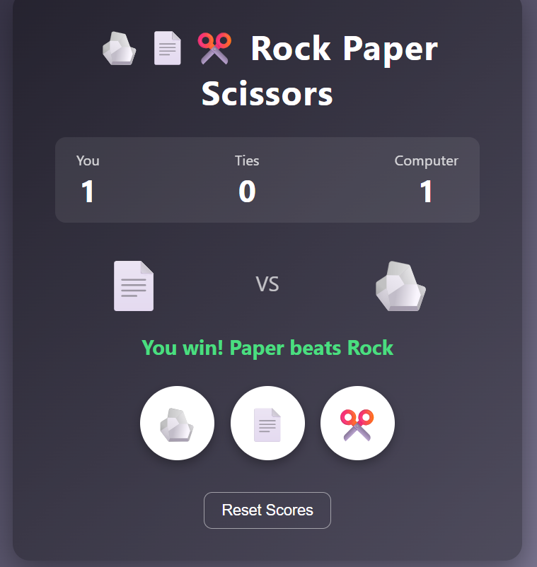

# 🪨📄✂️ Rock Paper Scissors Game

A simple and interactive **Rock Paper Scissors** game developed using **HTML, CSS, and JavaScript**. Challenge the computer, keep track of scores, and enjoy a clean, responsive interface with emoji-based gameplay.

## 🚀 Features

- 🎮 Play against the computer
- 🪨 Rock, 📄 Paper, ✂️ Scissors choices
- 🏆 Live scoreboard for Player, Computer, and Ties
- 🎯 Instant result after each round
- 😊 Emoji-based game interface
- 🔄 Reset scores with one click
- 📱 Responsive and modern UI
- ⚡ No database or external libraries required

## 🛠️ Technologies Used

- HTML5
- CSS3
- JavaScript (Vanilla JS)

## 📂 Project Structure

```
Rock-Paper-Scissors/
│── rock-paper-scissors.html
```

## ▶️ How to Run

1. Download or clone this repository.
2. Open `rock-paper-scissors.html` in your web browser.
3. Choose Rock, Paper, or Scissors.
4. Play against the computer and enjoy!

## 🎯 Game Rules

- Rock beats Scissors
- Scissors beats Paper
- Paper beats Rock
- If both players choose the same option, the round is a tie.

## 📸 Screenshot



## 📄 License

This project is open-source and available for learning and personal use